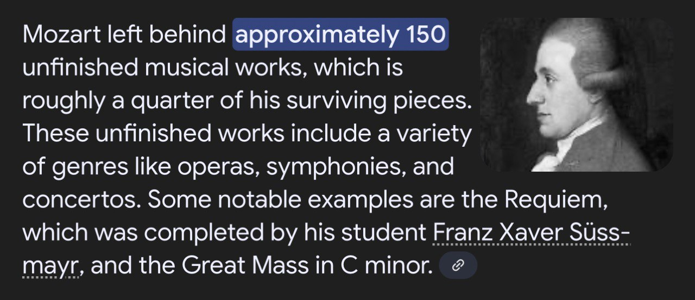

# Project Mozart 🎶



A `PyTorch` implementation of a Transformer-based music generation pipeline using `REMI` tokenization. This repo documents the full experimentation path, successful Model 2 plus the earlier failed-but-informative attempts, and highlights the technical decisions and lessons learned.

---

## Quick summary

- **Project Mozart** processes `MIDI` files, tokenizes them with `REMI`, trains custom `Transformer` models (several experiments), and generates MIDI output which can be converted to `WAV` using FluidSynth + custom SoundFonts. 
- **Model 2** is the working implementation that produces coherent piano music after training, although the output is still not the best (needs more training).
-  Models 0 and 1 did not produce usable final output but were vital experiments that demonstrate advanced engineering and debugging skills.

---

## Highlights / Why this is interesting

- **Engineering-first workflow:** multiple architecture experiments, tokenizer engineering, and loss-function design.
- **Practical music-token engineering** with REMI and structural constraints to improve validity of generated sequences.
- **Custom Transformer architecture** + training tricks (sinusoidal positional encodings, causal masking, label smoothing, gradient clipping).
- **Experimentation with parameter-efficient finetuning (LoRA)**, seq2seq models, and custom regularizers, shown as deliberate, reproducible experiments even when they failed.
- **End-to-end pipeline:** MIDI → tokenization → model → generate MIDI → synthesize WAV (FluidSynth + SoundFont).

---

## Project structure (short)

```
├── Model 0/              # failed experiment: GPT-2 medium + LoRA (tokenizer issues)
├── Model 1/              # failed experiment: facebook-BART seq2seq + LoRA (masking/loss issues)
├── Model 2/              # working model — current best
│   ├── create_data.py       # MIDI tokenization & dataset preparation (REMI)
│   ├── create_model.py      # MusicTransformer2 architecture
│   ├── train_model.py       # training loop, validation, checkpointing
│   ├── generate.py          # sampling & generation utilities
│   ├── notes_utils.py       # conversion, MIDI/WAV helpers, music-theory helpers
│   └── checkpoints/         # saved model checkpoints
└── Encoder and Decoder/  # original encoder/decoder components (used during earlier experiments)
```

---

## Quickstart

1. Tokenize MIDI dataset

```python
from create_data import tokenize_MIDI, get_vocab_size
tokenized = tokenize_MIDI("/path/to/midi_folder")
vocab_size, sequences = get_vocab_size(tokenizer, test_print=True)
```

2. Train (example)

```python
from create_model import MusicTransformer2
from train_model import train

model = MusicTransformer2(vocab_size=vocab_size)
train(model, train_loader, val_loader, tokenizer, epochs=10)
```

3. Generate and save MIDI and WAV files

```python
from generate import generate
generated_tokens = generate(model, tokenizer, max_len=2000, temperature=0.8)
# decode + save
```

---

## Checkpoint / resume tip (common bug fix)

If you load checkpoints and want to print `val_loss` in an f-string, use single quotes inside the f-string to avoid syntax errors:

```python
if resume_training:
    ckpt_path = "checkpoints/best_model.pt"
    checkpoint = torch.load(ckpt_path, map_location="cpu")
    optimizer.load_state_dict(checkpoint["optimizer_state"])
    scheduler.load_state_dict(checkpoint["scheduler_state"])
    print(f"Loaded best model (val_loss={checkpoint['val_loss']:.4f})")
```

---

## Model comparison

| Model       | Type / approach                                | Key techniques attempted                                                                                                                                                                                                                                                                                                                                                                           | Strengths / what was learned                                                                                                                                                                                                                                                        | Outcome                                                                                                                                      |
| ----------- | ---------------------------------------------- | -------------------------------------------------------------------------------------------------------------------------------------------------------------------------------------------------------------------------------------------------------------------------------------------------------------------------------------------------------------------------------------------------- | ----------------------------------------------------------------------------------------------------------------------------------------------------------------------------------------------------------------------------------------------------------------------------------- | -------------------------------------------------------------------------------------------------------------------------------------------- |
| **Model 0** | GPT-2 Medium (causal LM) with LoRA fine-tuning | - Integrated LoRA for parameter-efficient adaptation<br>- Custom loss with penalties for repeated `REST` tokens<br>- Flattened JSON-like MIDI representation with BPM, instruments, notes                                                                                                                                                                                                          | - Hands-on experience extending GPT-2 vocab with domain-specific tokens<br>- Learned tokenizer limitations for symbolic data (splitting tokens like `C4_q` to C, 4, q)<br>- Practiced scaling LoRA to large pretrained models                                                       | ❌ Generation collapsed to mostly `REST`; tokenizer fragmentation and extremely long input lines (>100k chars) made this approach impractical |
| **Model 1** | facebook-BART (seq2seq) with LoRA fine-tuning  | - Built dataset with masked inputs and unmasked targets (up to 50 tokens per line)<br>- Added all musical notes into tokenizer<br>- Custom loss penalizing non-music tokens<br>- Attempted rule-based enforcement via loss                                                                                                                                                                         | - Demonstrated ability to adapt `seq2seq` architectures to symbolic sequence generation<br>- Successfully re-engineered the tokenizer to preserve music tokens<br>- Learned about model “adversarial” behavior against loss rules (ignoring penalties)                              | ❌ Generated mostly non-music tokens; masking strategy too brittle; loss not sufficient to enforce structure                                  |
| **Model 2** | Custom Transformer (from scratch)              | - REMI tokenization (compact, music-aware)<br>- Sinusoidal positional encoding<br>- Causal triangular attention mask<br>- GPT-style embedding scaling<br>- LayerNorm before projection<br>- **Structural constraints** on token order (Bar → Position → Pitch → Velocity → Duration)<br>- Composite loss: cross-entropy + structural loss<br>- Training tricks: label smoothing, gradient clipping | - Designed and implemented full Transformer architecture with PyTorch<br>- Integrated domain knowledge into sequence rules<br>- Stabilized training with architectural/training refinements<br>- Built end-to-end pipeline: tokenize → train → validate → generate → synthesize WAV | ✅ First working system: produces coherent piano pieces; still limited quality but proves pipeline and model design                           |


---

## Technical achievements

- Built a complete **tokenization** pipeline for MIDI data (REMI), including vocabulary analysis and data sharding for training.
- Designed and implemented **structural token constraints** to enforce valid musical transitions (Bar → Position → Pitch → Velocity → Duration).
- Implemented a custom **Transformer-based model** (sinusoidal position encodings, causal masking, layernorm placement, embedding scaling).
- Engineered a **custom combined loss** (cross-entropy + structural loss) and diagnostic tooling to quantify non-musical tokens.
- Applied **training regularization**: label smoothing, gradient clipping, validation loop with checkpointing and resume support.
- Practical systems work: MIDI→WAV conversion with FluidSynth, SoundFont support, and sample generation scripts.
- Experimented with `LoRA` finetuning and `seq2seq` baselines; identified failure modes and iterated with principled fixes.
- Learned the practical difference between **causal LLMs** (predict next token given history) and **seq2seq models** (encode input sequence then decode output sequence).
- Built a functional `encoder` (MIDI → JSON-like text) and `decoder` (text → WAV) that, while not used in the final pipeline, *remain fully usable for other applications*.

---

## What worked (Model 2)

- **Tokenization** with REMI produced compact, music-aware vocabulary.
- **Causal attention** and **triangular masks** prevented token leakage.
- **Structural constraints** reduced syntactic invalid outputs and improved musical validity.
- **Training stability** improved with LayerNorm-before-projection, embedding scaling, and gradient clipping.
- End-to-end generation pipeline (tokenize → train → sample → synthesize) is reproducible.

---

## What failed (and why that’s valuable)

### 1. Data & preprocessing

- Flattening entire pieces into text lines >100k chars: learned to respect model input windows and the need to shard/segment sequences.
- Overly large datasets stressed memory and training time, highlighting the importance of data preprocessing, batching strategies, and even curriculum learning.

### 2. Tokenization

- Pretrained tokenizers (GPT-2) split musical tokens incorrectly (e.g., "C4_q" → "C", "4", "_", "q"): showed why domain-specific tokenization is essential.
- Experiments confirmed that language-based tokenizers assume natural text distributions, which don’t map well to symbolic music — leading to the design of a custom REMI tokenizer.
- Even when music notes are added to the pretrained tokenizer, they represent a smaller portion of the total number of tokens leading to ignoring them in most cases.

### 3. Modeling & architecture

- Loss-based enforcement with complex penalties encouraged adversarial behavior: models found shortcuts instead of following rules — a lesson in constrained optimization and unintended equilibria.
- Masking strategies in seq2seq (BART) still produced non-music tokens despite heavy penalties, teaching robustness testing, dataset balancing, and loss debugging.
- Learned the difference between causal LLMs (autoregressive, natural fit for sequence continuation) vs seq2seq models (encode input, then decode output) — and why causal LMs were better for open-ended music generation.

### 4. Training techniques

- LoRA finetuning reduced training cost but exposed the limits of parameter-efficient methods when pretrained weights are misaligned with the domain (language vs symbolic music).
- Exploding gradients and unstable training in earlier attempts underscored the need for gradient clipping, label smoothing, and better initialization.

### 5. Engineering lessons

- Encoder/decoder components (MIDI → text, text → WAV) didn’t integrate into the final model, but they remain functional standalone tools that can be reused in other projects.
- The iterative failures made it clear that building reusable modules (data pipeline, tokenizer, encoder/decoder, generation scripts) is just as valuable as the final model.

---
