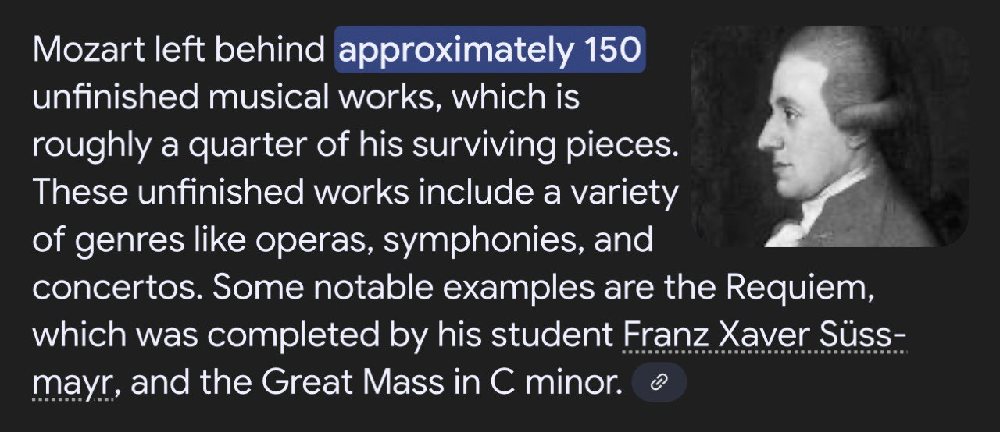

# Project Mozart 🎶



This project presents a **`PyTorch` implementation of a Transformer-based symbolic music generation pipeline** built around the **`REMI` tokenization** framework.

It traces the full experimental journey, from the early, failed-but-instructive attempts (**Model 0** and **Model 1**) to the inaccurate yet valuable **Model 2**, and finally to the **Model 3** architecture, which delivers consistently strong and musically coherent results.

All earlier experiments are preserved in the **`Archived Models/`** directory to document the iterative learning process and design evolution that led to Model 3’s success.

---

## Quick summary

- The pipeline processes `MIDI` files, tokenizes them with `REMI`, trains a custom `Transformer`, and generates new MIDI sequences that can be rendered to WAV using FluidSynth and custom SoundFonts.
    
- **Model 3** is the current best-performing model: it produces full multi-instrument compositions with strong structural coherence and musicality.
    
- The model can:
	- **Generate music from scratch**.
	- **Continue generation from an existing sequence**.
	- **Extend a given MIDI file**.
    
- The current training dataset includes:
	- **182 Mozart MIDI files**.
	- **83 Beethoven MIDI files**.
	- **92 Tchaikovsky MIDI files**.
    
- To generate music, simply run the `generate_music.ipynb` notebook in the **Model 3** folder.
- You can directly hear examples of generated outputs in `Example_Outputs/`, or for more generated audio files (MIDI and wav) go to `Model 3/model_outputs/`.

---
## What's new in Model 3

- **Model 3** was implemented *from scratch* (hand-written code; no AI-assisted code generation was used), discarding the previous failed model code to start fresh.
- The most **impactful improvements** came from careful **tokenizer configuration** and extensive hyperparameter tuning to better match our dataset.
- Two major functional upgrades:
	- **Multiple-instrument support**, enabling richer, polyphonic outputs.
	- **Post-generation cleaning** to remove nulls and other token artifacts that previously broke musical structure.
- Dataset, dataloader, and model parameter shapes were chosen after multiple experiments to **balance output quality and training time**: an early experiment required *~200 hours per epoch*; current runs complete an epoch in *~1.5 hours*.
- The dataset now uses **token IDs directly**, which simplifies training and avoided the manual token -> ID conversion that slowed Model 2.

>**Note:** Training Model 3 requires only 2-3 epochs, however it is better to train on **one dataset only** per model not all at the same time, as the model sounds way better when it learns one style and not mix them together.

---
## Project structure

> Note: many older files in `Archived Models/` were renamed and reorganized; those historical scripts may contain outdated import paths.

```
├── Archived Models/
│   ├── Encoder and Decoder/  # initial encoder/decoder prototypes (pre-Model 3)
│   ├── Model 0/              # failed experiment: GPT-2 Medium + LoRA (tokenizer failure)
│   ├── Model 1/              # failed experiment: facebook-BART seq2seq + LoRA (masking/loss issues)
│   ├── Model 2/              # inaccurate outputs but key design lessons
│   └── rejected files/       # incomplete or unstable experiments (mainly data related)
│
├── Model 3/                  # final, high-performing model
│   ├── data/                 # processed datasets and MIDI token sequences
│   ├── experiments/          # configuration trials and evaluation notes
│   ├── model_outputs/        # generated Model 3 example outputs
│	│   ├── midi_files/           # example MIDI outputs
│	│   └── wav_files/            # corresponding audio renderings of Model 3 outputs
│   ├── training/             # scripts for model training and evaluation
│   ├── generate.py               # functions for generating new compositions
│	├── model.py                  # final Transformer architecture (Model 3)
│	├── train.ipynb               # interactive training notebook
│	└── generate_music.ipynb      # generation and qualitative notebook
│
├── Example Outputs/      # Ready to play examples generated by the model
└── midi_dataset/         # raw MIDI data
```

---

## Future Work:
- [ ] Try more composers.
- [ ] Try to fine tune the model for less hallusination and even cleanier output everytime (now it produces one really good symphony every 2 tries).